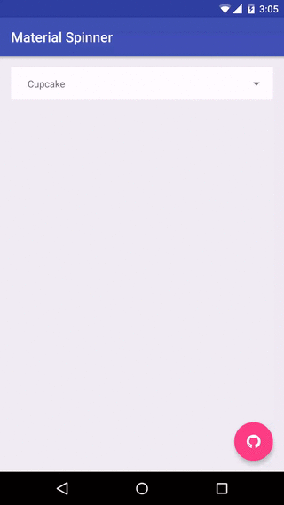

<h1 align="center">Material Spinner</h1>

<p align="center">
  <a target="_blank" href="https://developer.android.com/reference/android/os/Build.VERSION_CODES.html#ICE_CREAM_SANDWICH"></a>
  <a target="_blank" href="LICENSE"></a>
  <a target="_blank" href="https://maven-badges.herokuapp.com/maven-central/com.jaredrummler/material-spinner"></a>
  <a target="_blank" href="http://www.methodscount.com/?lib=com.jaredrummler%3Amaterial-spinner%3A1.3.1"></a>
  <a target="_blank" href="https://twitter.com/jaredrummler"></a>
</p>

___



Usage
-----

Add the spinner to your layout XML:

```xml
<com.jaredrummler.materialspinner.MaterialSpinner
    android:id="@+id/spinner"
    android:layout_width="match_parent"
    android:layout_height="wrap_content"/>
```

Add items to the spinner and listen for clicks:

```java
MaterialSpinner spinner = (MaterialSpinner) findViewById(R.id.spinner);
spinner.setItems("Ice Cream Sandwich", "Jelly Bean", "KitKat", "Lollipop", "Marshmallow");
spinner.setOnItemSelectedListener(new MaterialSpinner.OnItemSelectedListener<String>() {

  @Override public void onItemSelected(MaterialSpinner view, int position, long id, String item) {
    Snackbar.make(view, "Clicked " + item, Snackbar.LENGTH_LONG).show();
  }
});
```

You can add attributes to customize the view. Available attributes:

| name                    | type      | info                                                   |
|-------------------------|-----------|--------------------------------------------------------|
| ms_arrow_tint           | color     | sets the color on the drop-down arrow                  |
| ms_hide_arrow           | boolean   | set to true to hide the arrow drawable                 |
| ms_background_color     | color     | set the background color for the spinner and drop-down |
| ms_background_selector  | integer   | set the background resource for the dropdown items     |
| ms_text_color           | color     | set the text color                                     |
| ms_dropdown_max_height  | dimension | set the max height of the drop-down                    |
| ms_dropdown_height      | dimension | set the height of the drop-down                        |
| ms_padding_top          | dimension | set the top padding of the drop-down                   |
| ms_padding_left         | dimension | set the left padding of the drop-down                  |
| ms_padding_bottom       | dimension | set the bottom padding of the drop-down                |
| ms_padding_right        | dimension | set the right padding of the drop-down                 |
| ms_popup_padding_top    | dimension | set the top padding of the drop-down items             |
| ms_popup_padding_left   | dimension | set the left padding of the drop-down items            |
| ms_popup_padding_bottom | dimension | set the bottom padding of the drop-down items          |
| ms_popup_padding_right  | dimension | set the right padding of the drop-down items           |

Download
--------

Download [the latest AAR](https://repo1.maven.org/maven2/com/jaredrummler/material-spinner/1.3.1/material-spinner-1.3.1.aar) or grab via Gradle:

```groovy
compile 'com.jaredrummler:material-spinner:1.3.1'
```
or Maven:
```xml
<dependency>
  <groupId>com.jaredrummler</groupId>
  <artifactId>material-spinner</artifactId>
  <version>1.3.1</version>
  <type>aar</type>
</dependency>
```

Acknowledgements
----------------

[Nice Spinner](https://github.com/arcadefire/nice-spinner) by Angelo Marchesin

License
--------

    Copyright (C) 2016 Jared Rummler

    Licensed under the Apache License, Version 2.0 (the "License");
    you may not use this file except in compliance with the License.
    You may obtain a copy of the License at

       http://www.apache.org/licenses/LICENSE-2.0

    Unless required by applicable law or agreed to in writing, software
    distributed under the License is distributed on an "AS IS" BASIS,
    WITHOUT WARRANTIES OR CONDITIONS OF ANY KIND, either express or implied.
    See the License for the specific language governing permissions and
    limitations under the License.
